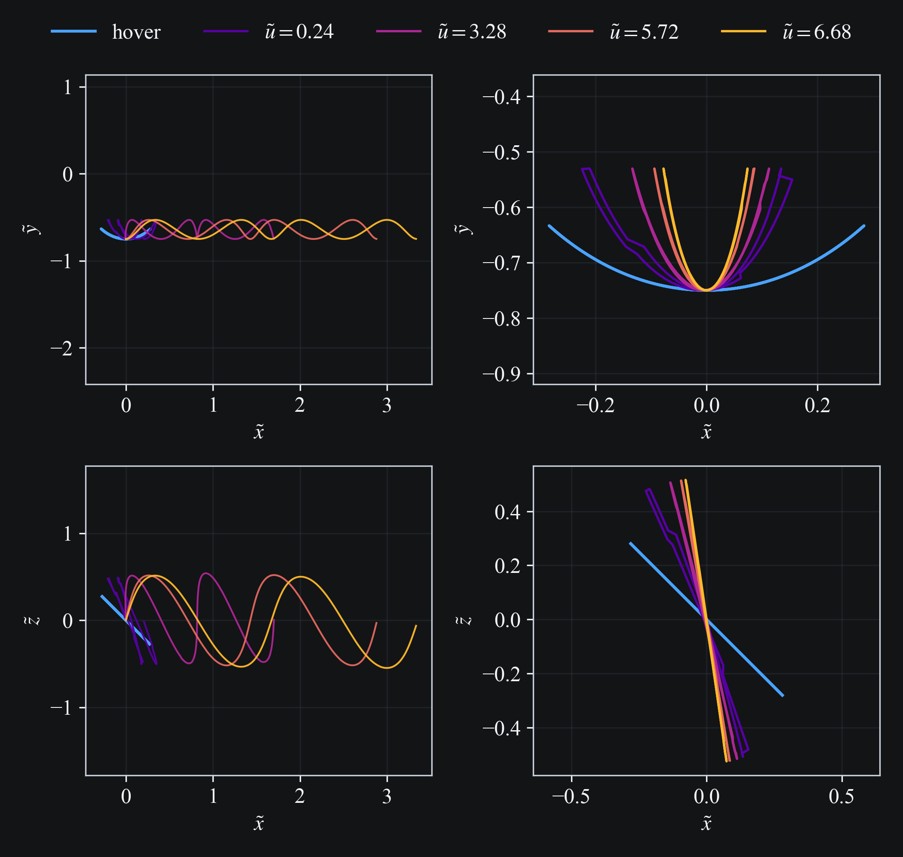
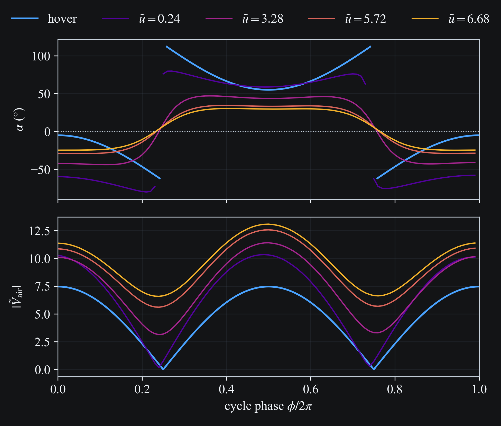
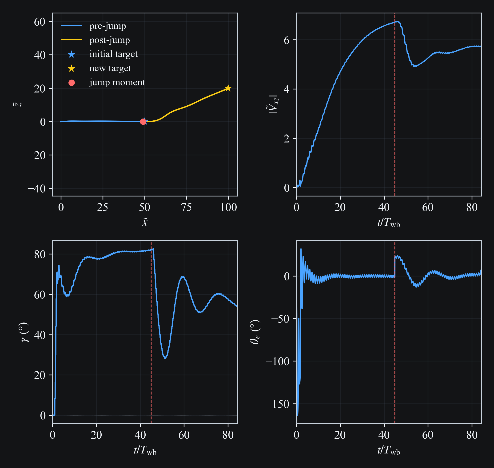
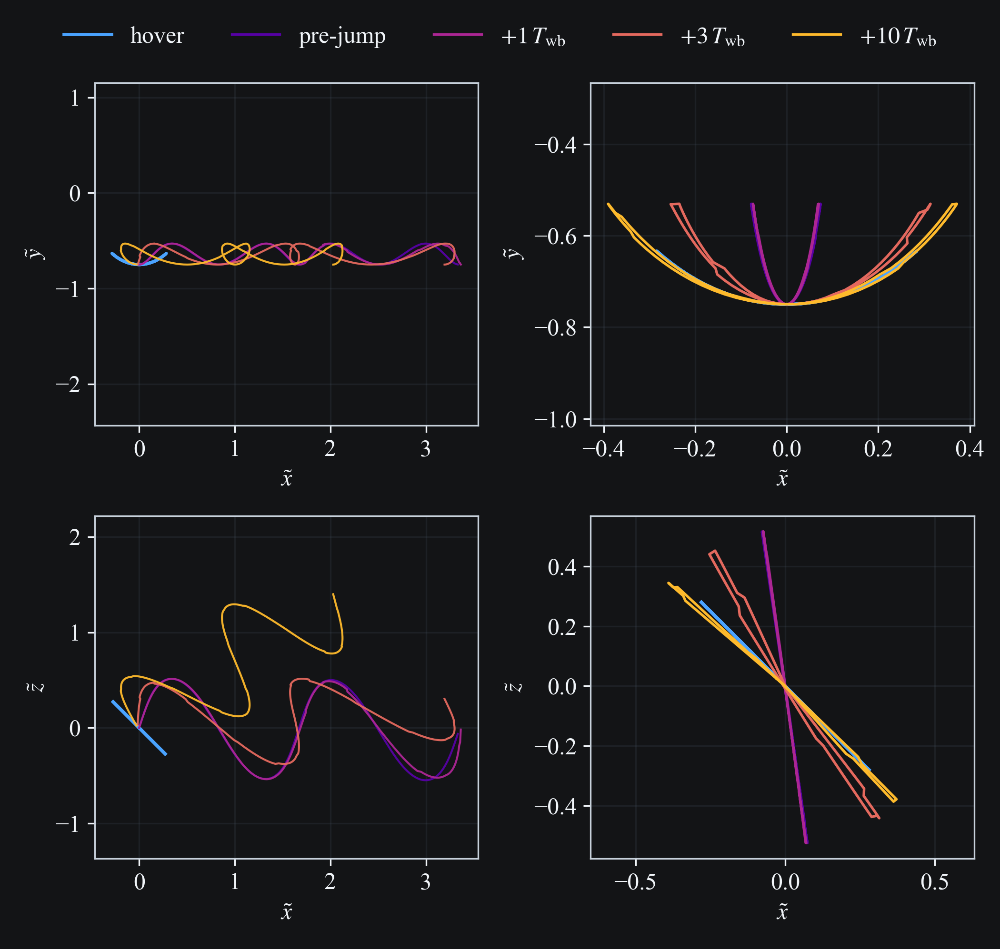
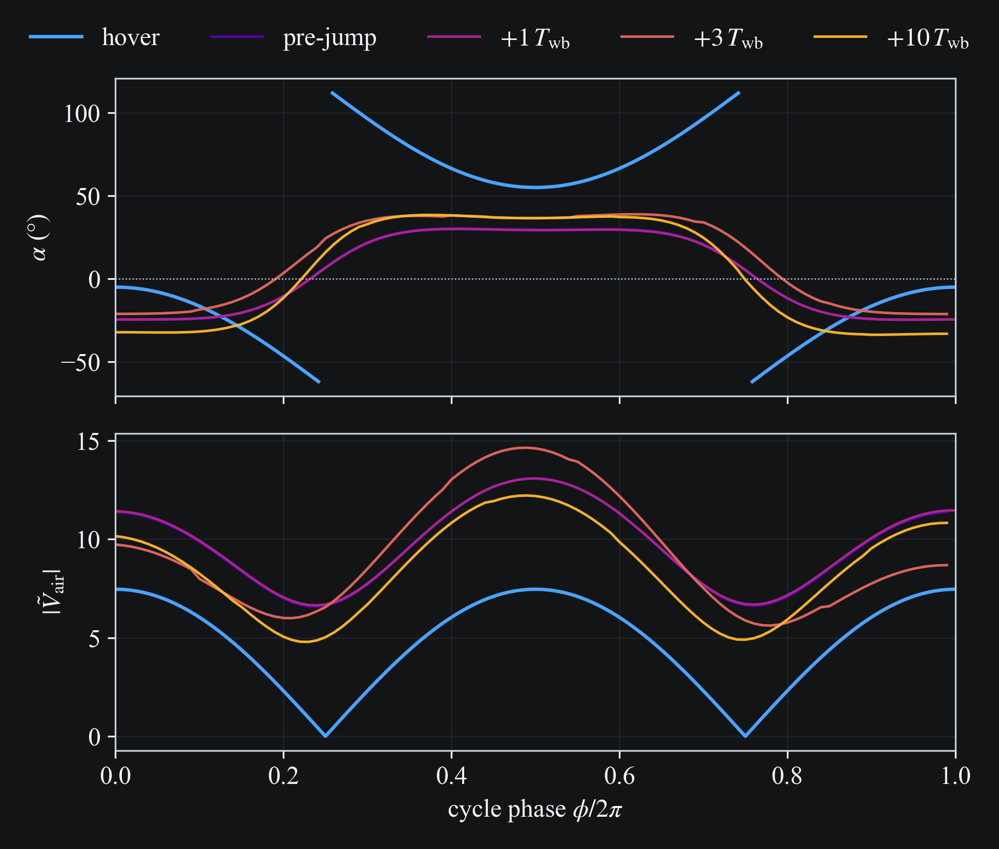

# Maneuvering Kinematics

```{raw} html
<div style="margin-bottom:1.5rem;">
  
</div>
```

```{raw} html
<div style="margin-bottom:1.5rem;">
  
</div>
```

```{raw} html
<div style="margin-bottom:1.5rem;">
  
</div>
```

```{raw} html
<div style="margin-bottom:1.5rem;">
  
</div>
```

```{raw} html
<div style="margin-bottom:1.5rem;">
  
</div>
```
