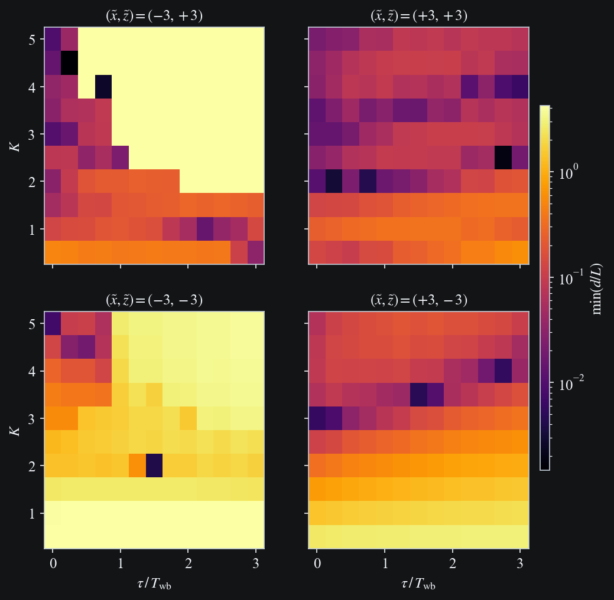
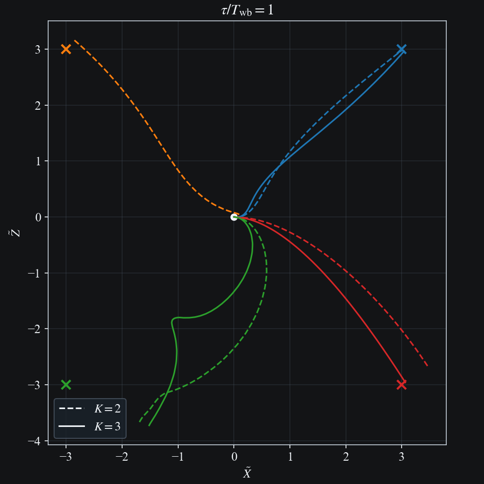
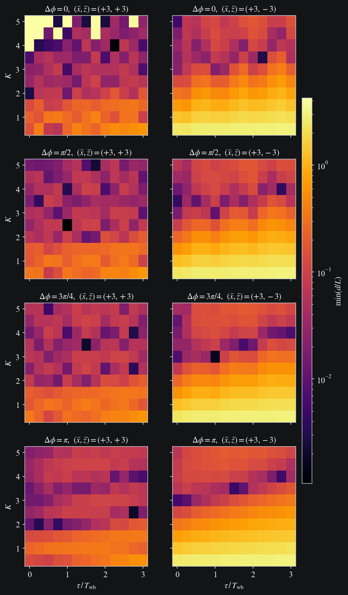
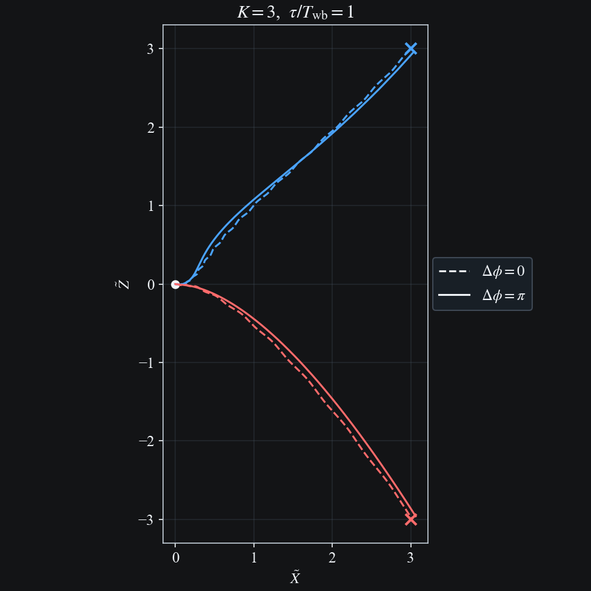
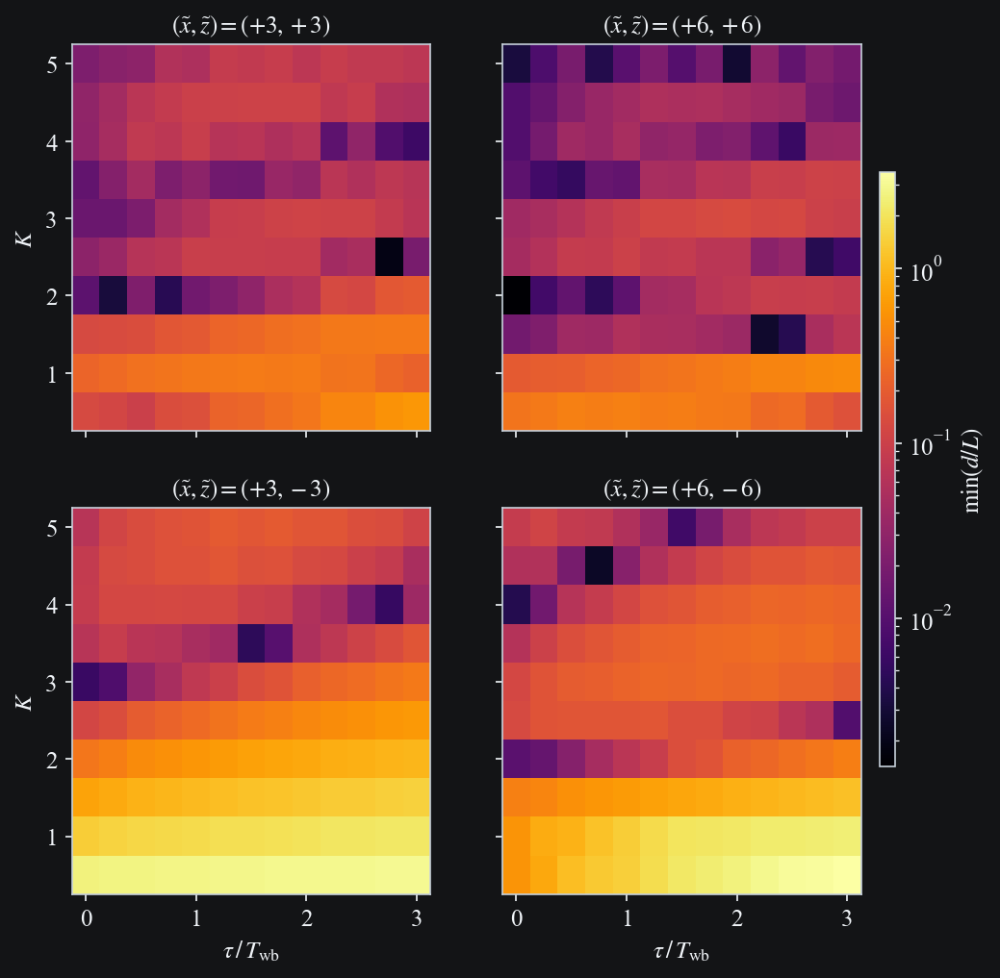
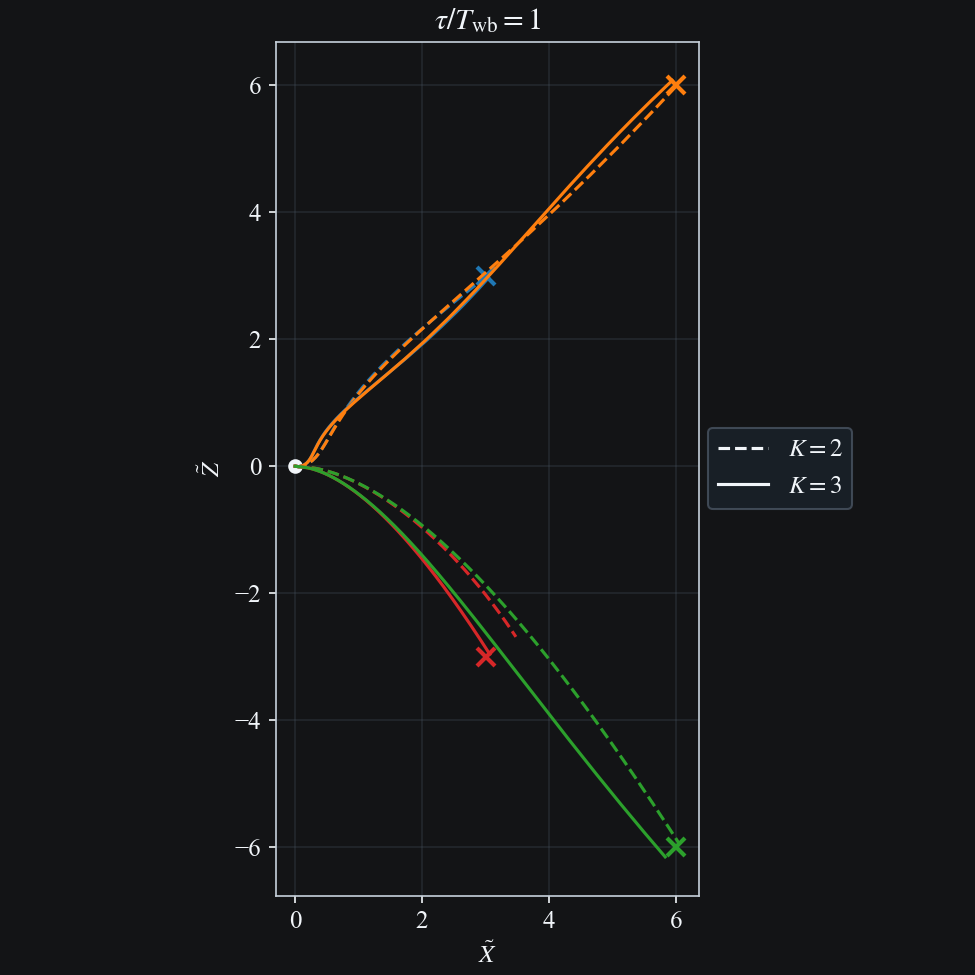

# Pursuit k-tau

## Stationary Prey

### ($\tilde{x} = \pm 3$, $\tilde{z} = \pm 3$)

```{raw} html
<div style="margin-bottom:1.5rem;">
  
</div>
```

```{raw} html
<div style="margin-bottom:1.5rem;">
  
</div>
```

### Influence of fore/hind wing phase shift

```{raw} html
<div style="margin-bottom:1.5rem;">
  
</div>
```

```{raw} html
<div style="margin-bottom:1.5rem;">
  
</div>
```

### Influence of target distance

```{raw} html
<div style="margin-bottom:1.5rem;">
  
</div>
```

```{raw} html
<div style="margin-bottom:1.5rem;">
  
</div>
```
